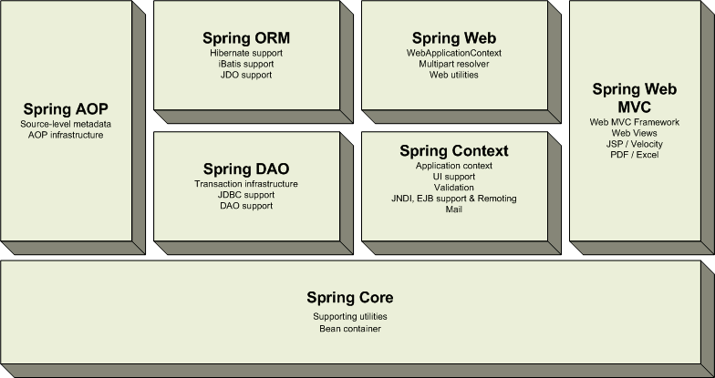
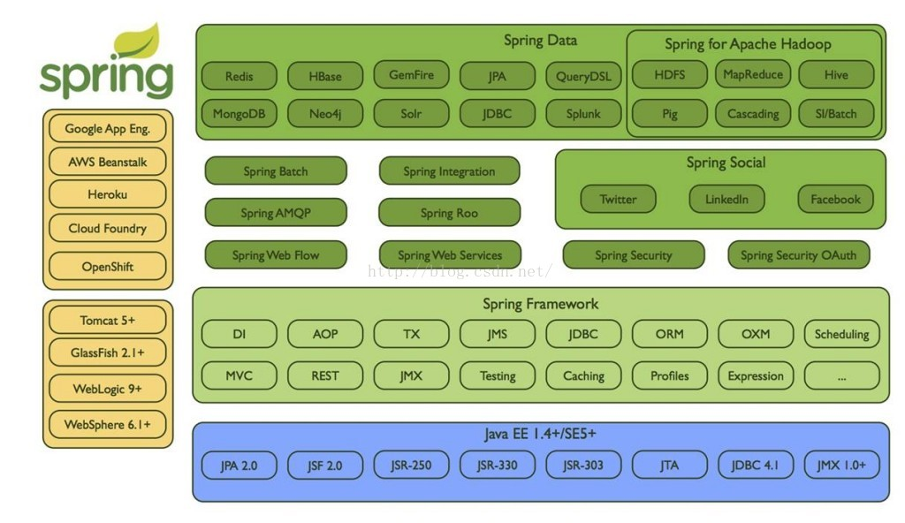

# Spring基础知识

## 什么是Spring框架？Spring框架有哪些主要模块？
Spring框架是一个为Java应用程序的开发提供了综合、广泛的基础性支持的Java平台。


核心容器、数据访问/集成,、Web、AOP（面向切面编程）、工具、消息和测试模块。



## 使用Spring框架能带来哪些好处？
1. Dependency Injection(DI) 方法使得构造器和JavaBean properties文件中的依赖关系一目了然。
2. 与EJB容器相比较，IoC容器更加趋向于轻量级。这样一来IoC容器在有限的内存和CPU资源的情况下进行应用程序的开发和发布就变得十分有利。
3. Spring并没有闭门造车，Spring利用了已有的技术比如ORM框架、logging框架、J2EE、Quartz和JDK Timer，以及其他视图技术。
4. Spring框架是按照模块的形式来组织的。由包和类的编号就可以看出其所属的模块，开发者仅仅需要选用他们需要的模块即可。
5. 要测试一项用Spring开发的应用程序十分简单，因为测试相关的环境代码都已经囊括在框架中了。更加简单的是，利用JavaBean形式的POJO类，可以很方便的利用依赖注入来写入测试数据。
6. Spring的Web框架亦是一个精心设计的Web MVC框架，为开发者们在web框架的选择上提供了一个除了主流框架比如Struts、过度设计的、不流行web框架的以外的有力选项。
7. Spring提供了一个便捷的事务管理接口，适用于小型的本地事物处理（比如在单DB的环境下）和复杂的共同事物处理（比如利用JTA的复杂DB环境）。

## 什么是控制反转(IOC)？什么是依赖注入(DI)？
在运行时被装配器对象来绑定耦合对象的一种编程技巧，对象之间耦合关系在编译时通常是未知的。在传统的编程方式中，业 务逻辑的流程是由应用程序中的早已被设定好关联关系的对象来决定的。在使用控制反转的情况下，业务逻辑的流程是由对象关系图来决定的，该对象关系图由装配 器负责实例化，这种实现方式还可以将对象之间的关联关系的定义抽象化。而绑定的过程是通过“依赖注入”实现的。

控制反转是一种以给予应用程序中目标组件更多控制为目的设计范式，并在我们的实际工作中起到了有效的作用。
依赖注入是在编译阶段尚未知所需的功能是来自哪个的类的情况下，将其他对象所依赖的功能对象实例化的模式。这就需要一种机制用来激活相应的组件以提供特定的功能，所以依赖注入是控制反转的基础。

### 在Java中依赖注入有以下三种实现方式：
1. 构造器注入
2. Setter方法注入
3. 接口注入(基于注解的注入)

## 请解释下Spring框架中的IoC？
Spring中的 org.springframework.beans 包和 org.springframework.context包构成了Spring框架IoC容器的基础。

BeanFactory 接口提供了一个先进的配置机制，使得任何类型的对象的配置成为可能。ApplicationContex接口对BeanFactory（是一个子接口）进行了扩展，在BeanFactory的基础上添加了其他功能，比如与Spring的AOP更容易集成，也提供了处理message resource的机制（用于国际化）、事件传播以及应用层的特别配置，比如针对Web应用的WebApplicationContext。

org.springframework.beans.factory.BeanFactory 是Spring IoC容器的具体实现，用来包装和管理前面提到的各种bean。BeanFactory接口是Spring IoC 容器的核心接口。
**IOC:把对象的创建、初始化、销毁交给spring来管理，而不是由开发者控制，实现控制反转。**

## BeanFactory和ApplicationContext有什么区别？
BeanFactory 可以理解为含有bean集合的工厂类。BeanFactory 包含了种bean的定义，以便在接收到客户端请求时将对应的bean实例化。
BeanFactory还能在实例化对象的时生成协作类之间的关系。此举将bean自身与bean客户端的配置中解放出来。BeanFactory还包含 了bean生命周期的控制，调用客户端的初始化方法（initialization methods）和销毁方法（destruction methods）。
从表面上看，application context如同bean factory一样具有bean定义、bean关联关系的设置，根据请求分发bean的功能。但

### applicationcontext在此基础上还提供了其他的功能。
1. 提供了支持国际化的文本消息
2. 统一的资源文件读取方式
3. 已在监听器中注册的bean的事件


## Spring有几种配置方式？
1. 基于XML的配置
2. 基于注解的配置
3. 基于Java的配置

## 如何用基于Java配置的方式配置Spring？
在Spring框架中，依赖和服务需要在专门的配置文件来实现，我常用的XML格式的配置文件。这些配置文件的格式通常用<beans>开头，然后一系列的bean定义和专门的应用配置选项组成。
SpringXML配置的主要目的时候是使所有的Spring组件都可以用xml文件的形式来进行配置。这意味着不会出现其他的Spring配置类型（比如声明的方式或基于Java Class的配置方式）
Spring的XML配置方式是使用被Spring命名空间的所支持的一系列的XML标签来实现的。Spring有以下主要的命名空间：context、beans、jdbc、tx、aop、mvc和aso。

```xml
<beans>    
    <!-- JSON Support -->    
    <bean name="viewResolver" class="org.springframework.web.servlet.view.BeanNameViewResolver"/>    
    <bean name="jsonTemplate" class="org.springframework.web.servlet.view.json.MappingJackson2JsonView"/>    
    <bean id="restTemplate" class="org.springframework.web.client.RestTemplate"/>    
</beans>   

```

下面这个web.xml仅仅配置了DispatcherServlet，这件最简单的配置便能满足应用程序配置运行时组件的需求。

```xml
<web-app>    
    <display-name>Archetype Created Web Application</display-name>    
    <servlet>    
        <servlet-name>spring</servlet-name>    
      <servlet-class>org.springframework.web.servlet.DispatcherServlet</servlet-class>    
        <load-on-startup>1</load-on-startup>    
    </servlet>    
    <servlet-mapping>    
        <servlet-name>spring</servlet-name>    
        <url-pattern>/</url-pattern>    
    </servlet-mapping>    
</web-app>   

```

## 如何用基于Java配置的方式配置Spring？
Spring对Java配置的支持是由@Configuration注解和@Bean注解来实现的。由@Bean注解的方法将会实例化、配置和初始化一个 新对象，这个对象将由Spring的IoC容器来管理。@Bean声明所起到的作用与<bean/> 元素类似。被 @Configuration所注解的类则表示这个类的主要目的是作为bean定义的资源。被@Configuration声明的类可以通过在同一个类的 内部调用@bean方法来设置嵌入bean的依赖关系。
最简单的@Configuration 声明类请参考下面的代码：
```java
@Configuration    
public class AppConfig{    
    @Bean    
    public MyService myService() {    
        return new MyServiceImpl();    
    }    
}  

```
对于上面的@Beans配置文件相同的XML配置文件如下：

```xml
<beans>    
    <bean id="myService" class="com.somnus.services.MyServiceImpl"/>    
</beans> 
   
```
上述配置方式的实例化方式如下：利用AnnotationConfigApplicationContext 类进行实例化
```java
public static void main(String[] args) {    
    ApplicationContext ctx = new AnnotationConfigApplicationContext(AppConfig.class);    
    MyService myService = ctx.getBean(MyService.class);    
    myService.doStuff();    
} 

```

## 怎样用注解的方式配置Spring？
注解装配在Spring中是默认关闭的。所以需要在Spring文件中配置一下才能使用基于注解的装配模式。如果你想要在你的应用程序中使用关于注解的方法的话，请参考如下的配置。

```xml
<beans>    
   <context:annotation-config/>    
   <!-- bean definitions go here -->    
</beans> 
```
在 <context:annotation-config/>标签配置完成以后，就可以用注解的方式在Spring中向属性、方法和构造方法中自动装配变量。
下面是几种比较重要的注解类型：

@Required：该注解应用于设值方法。
@Autowired：该注解应用于有值设值方法、非设值方法、构造方法和变量。
@Qualifier：该注解和@Autowired注解搭配使用，用于消除特定bean自动装配的歧义。
JSR-250 Annotations：Spring支持基于JSR-250 注解的以下注解，@Resource、@PostConstruct 和 @PreDestroy。

## 请解释Spring Bean的生命周期？
Spring Bean的生命周期简单易懂。在一个bean实例被初始化时，需要执行一系列的初始化操作以达到可用的状态。同样的，当一个bean不在被调用时需要进行相关的析构操作，并从bean容器中移除。
Spring bean factory 负责管理在spring容器中被创建的bean的生命周期。

Bean的生命周期由两组回调（call back）方法组成。
1. 初始化之后调用的回调方法。
2. 销毁之前调用的回调方法。

## Spring Bean的作用域之间有什么区别？
1. singleton：这种bean范围是默认的，这种范围确保不管接受到多少个请求，每个容器中只有一个bean的实例，单例的模式由bean factory自身来维护。
2. prototype：原形范围与单例范围相反，为每一个bean请求提供一个实例。
3. request：在请求bean范围内会每一个来自客户端的网络请求创建一个实例，在请求完成以后，bean会失效并被垃圾回收器回收。
4. session：与请求范围类似，确保每个session中有一个bean的实例，在session过期后，bean会随之失效。
5. global-session：global-session和Portlet应用相关。当你的应用部署在Portlet容器中工作时，它包含很多portlet。如果 你想要声明让所有的portlet共用全局的存储变量的话，那么这全局变量需要存储在global-session中。
全局作用域与Servlet中的session作用域效果相同。

## 什么是Spring inner beans？
在Spring框架中，无论何时bean被使用时，当仅被调用了一个属性。一个明智的做法是将这个bean声明为内部bean。内部bean可以用setter注入“属性”和构造方法注入“构造参数”的方式来实现。
比如，在我们的应用程序中，一个Customer类引用了一个Person类，我们的要做的是创建一个Person的实例，然后在Customer内部使用。

```java
public class Customer{    
    private Person person;    
    //Setters and Getters    
}   
```
```java
public class Person{    
    private String name;    
    private String address;    
    private int age;    
    //Setters and Getters    
}  
```

```xml
<bean id="CustomerBean" class="com.somnus.common.Customer">    
    <property name="person">    
        <!-- This is inner bean -->    
        <bean class="com.ujiuye.common.Person">    
            <property name="name" value="lokesh" />    
            <property name="address" value="India" />    
            <property name="age" value="34" />    
        </bean>    
    </property>    
</bean>   

```

## Spring框架中的单例Beans是线程安全的么？
Spring框架并没有对单例bean进行任何多线程的封装处理。关于单例bean的线程安全和并发问题需要开发者自行去搞定。但实际上，大部分的Spring bean并没有可变的状态(比如Service类和DAO类)，所以在某种程度上说Spring的单例bean是线程安全的。如果你的bean有多种状态的话（比如 View Model 对象），就需要自行保证线程安全。最浅显的解决办法就是将多态bean的作用域由“singleton”变更为“prototype”。
## 请举例说明如何在Spring中注入一个Java Collection？
Spring提供了以下四种集合类的配置元素：
1. list:该标签用来装配可重复的list值。
2. set:该标签用来装配没有重复的set值。
3. map:该标签可用来注入键和值可以为任何类型的键值对。
4. props:该标签支持注入键和值都是字符串类型的键值对

## 如何向Spring Bean中注入一个Java.util.Properties？
```xml
<beans>    
   <!-- Definition for javaCollection -->    
   <bean id="javaCollection" class="com.howtodoinjava.JavaCollection">    
      <!-- java.util.List -->    
      <property name="customList">    
        <list>    
           <value>INDIA</value>    
           <value>Pakistan</value>    
           <value>USA</value>    
           <value>UK</value>    
        </list>    
      </property>    
     
     <!-- java.util.Set -->    
     <property name="customSet">    
        <set>    
           <value>INDIA</value>    
           <value>Pakistan</value>    
           <value>USA</value>    
           <value>UK</value>    
        </set>    
      </property>    
     
     <!-- java.util.Map -->    
     <property name="customMap">    
        <map>    
           <entry key="1" value="INDIA"/>    
           <entry key="2" value="Pakistan"/>    
           <entry key="3" value="USA"/>    
           <entry key="4" value="UK"/>    
        </map>    
      </property>    
     
    <!-- java.util.Properties -->    
    <property name="customProperies">    
        <props>    
            <prop key="admin">admin@nospam.com</prop>    
            <prop key="support">support@nospam.com</prop>    
        </props>    
    </property>    
     
   </bean>    
</beans>

```
## 如何向Spring Bean中注入一个Java.util.Properties？
第一种方法是使用如下面代码所示的props标签：
```xml
<bean id="adminUser" class="com.somnus.common.Customer">         
    <!-- java.util.Properties -->    
    <property name="emails">    
        <props>    
            <prop key="admin">admin@nospam.com</prop>    
            <prop key="support">support@nospam.com</prop>    
        </props>    
    </property>    
</bean>

```
也可用”util:”命名空间来从properties文件中创建出一个propertiesbean，然后利用setter方法注入bean的引用。 

## 请解释Spring Bean的自动装配？
在Spring框架中，在配置文件中设定bean的依赖关系是一个很好的机制，Spring容器还可以自动装配合作关系bean之间的关联关系。这意味着 Spring可以通过向Bean Factory中注入的方式自动搞定bean之间的依赖关系。自动装配可以设置在每个bean上，也可以设定在特定的bean上。
下面的XML配置文件表明了如何根据名称将一个bean设置为自动装配：
```xml
<bean id="employeeDAO" class="com.howtodoinjava.EmployeeDAOImpl" autowire="byName" />  
```
除了bean配置文件中提供的自动装配模式，还可以使用@Autowired注解来自动装配指定的bean。在使用@Autowired注解之前需要在按照如下的配置方式在Spring配置文件进行配置才可以使用。
```xml
<context:annotation-config /> 
```
配置好以后就可以使用@Autowired来标注了。
```java
@Autowired    
public EmployeeDAOImpl ( EmployeeManager manager ) {    
    this.manager = manager;    
}  
```

## 请解释自动装配模式的区别?
在Spring框架中共有5种自动装配
1. no：这是Spring框架的默认设置，在该设置下自动装配是关闭的，开发者需要自行在bean定义中用标签明确的设置依赖关系。
2. byName：该选项可以根据bean名称设置依赖关系。当向一个bean中自动装配一个属性时，容器将根据bean的名称自动在在配置文件中查询一个匹配的bean。如果找到的话，就装配这个属性，如果没找到的话就报错。
3. byType：该选项可以根据bean类型设置依赖关系。当向一个bean中自动装配一个属性时，容器将根据bean的类型自动在在配置文件中查询一个匹配的bean。如果找到的话，就装配这个属性，如果没找到的话就报错。
4. constructor：造器的自动装配和byType模式类似，但是仅仅适用于与有构造器相同参数的bean，如果在容器中没有找到与构造器参数类型一致的bean，那么将会抛出异常。
5. autodetect：该模式自动探测使用构造器自动装配或者byType自动装配。首先，首先会尝试找合适的带参数的构造器，如果找到的话就是用构造器自动装配，如果在bean内部没有找到相应的构造器或者是无参构造器，容器就会自动选择byTpe的自动装配方式。

## 如何开启基于注解的自动装配？
要使用 @Autowired，需要注册 AutowiredAnnotationBeanPostProcessor，可以有以下两种方式来实现：
1. 引入配置文件中的<bean>下引入 context:annotation-config
```xml
<beans>    
    <context:annotation-config />    
</beans> 
```
2. 在bean配置文件中直接引入AutowiredAnnotationBeanPostProcessor
```xml
<beans>    
    <bean class="org.springframework.beans.factoryannotationAutowiredAnnotationBeanPostProcessor"/>    
</beans>
```

## 请举例解释@Required注解？
该@Required注解适用于bean属性setter方法，并表示受影响的bean属性必须在XML配置文件在配置时进行填充。否则，容器会抛出一个BeanInitializationException异常。
## 请举例解释@Autowired注解？
@Autowired 注释，它可以对类成员变量、方法及构造函数进行标注，完成自动装配的工作。 通过 @Autowired的使用来消除 set ，get方法。在使用@Autowired之前，我们对一个bean配置起属性时，是这用用的
```xml
<property name="属性名" value=" 属性值"/> 
```
通过这种方式来，配置比较繁琐，而且代码比较多。在Spring 2.5 引入了 @Autowired 注释
## 请举例说明@Qualifier注解？
使用@Quanlifier注解告诉Spring 哪个bean应该被autowired的。

## 构造注入和设值注入有什么区别？
请注意以下明显的区别：
1. 在设值注入方法支持大部分的依赖注入，如果我们仅需 要注入int、string和long型的变量，我们不要用设值的方法注入。对于基本类型，如果我们没有注入的话，可以为基本类型设置默认值。在构造方法 注入不支持大部分的依赖注入，因为在调用构造方法中必须传入正确的构造参数，否则的话为报错。
2. 设值注入不会重写构造方法的值。如果我们对同一个变量同时使用了构造方法注入又使用了设置方法注入的话，那么构造方法将不能覆盖由设值方法注入的值。很明显，因为构造方法尽在对象被创建时调用。
3. 在使用设值注入时有可能还不能保证某种依赖是否已经被注入，也就是说这时对象的依赖关系有可能是不完整的。而在另一种情况下，构造器注入则不允许生成依赖关系不完整的对象。
4. 在设值注入时如果对象A和对象B互相依赖，在创建对象A时Spring会抛出sObjectCurrentlyInCreationException异常，因为在B对象被创建之前A对象是不能被创建的，反之亦然。所以Spring用设值注入的方法解决了循环依赖的问题，因对象的设值方法是在对象被创建之前被调用的。

## Spring中有哪些不同类型的事件？
Spring的ApplicationContext 提供了支持事件和代码中监听器的功能。
我们可以创建bean用来监听在ApplicationContext 中发布的事件。ApplicationEvent类和在ApplicationContext接口中处理的事件，如果一个bean实现了ApplicationListener接口，当一个ApplicationEvent 被发布以后，bean会自动被通知。
```java
public class AllApplicationEventListener implements ApplicationListener < ApplicationEvent >{    
    @Override    
    public void onApplicationEvent(ApplicationEvent applicationEvent)    
    {    
        //process event    
    }    
}  
```
Spring 提供了以下5中标准的事件：
1. 上下文更新事件（ContextRefreshedEvent）：该事件会在ApplicationContext被初始化或者更新时发布。也可以在调用ConfigurableApplicationContext 接口中的refresh()方法时被触发。
2. 上下文开始事件（ContextStartedEvent）：当容器调用ConfigurableApplicationContext的Start()方法开始/重新开始容器时触发该事件。
3. 上下文停止事件（ContextStoppedEvent）：当容器调用ConfigurableApplicationContext的Stop()方法停止容器时触发该事件。
4. 上下文关闭事件（ContextClosedEvent）：当ApplicationContext被关闭时触发该事件。容器被关闭时，其管理的所有单例Bean都被销毁。
5. 请求处理事件（RequestHandledEvent）：在Web应用中，当一个http请求（request）结束触发该事件。

## FileSystemResource和ClassPathResource有何区别？
在FileSystemResource 中需要给出spring-config.xml文件在你项目中的相对路径或者绝对路径。在ClassPathResource中spring会在ClassPath中自动搜寻配置文件，所以要把ClassPathResource 文件放在ClassPath下。
如果将spring-config.xml保存在了src文件夹下的话，只需给出配置文件的名称即可，因为src文件夹是默认。
简而言之，ClassPathResource在环境变量中读取配置文件，FileSystemResource在配置文件中读取配置文件。

## Spring 中都用到了哪些设计模式？
1. 代理模式—在AOP和remoting中被用的比较多。
2. 单例模式—在spring配置文件中定义的bean默认为单例模式。
3. 模板方法—用来解决代码重复的问题。比如. RestTemplate, JdbcTemplate。
4. 前端控制器—Spring提供了DispatcherServlet来对请求进行分发。
5. 视图帮助(View Helper )—Spring提供了一系列的JSP标签，高效宏来辅助将分散的代码整合在视图里。
6. 依赖注入—贯穿于BeanFactory / ApplicationContext接口的核心理念。
7. 工厂模式—BeanFactory用来创建对象的实例
8. 适配器模式： HandlerAdapter适配器模式


## 开发中使用 Spring 的什么技术 ?
1. IOC 容器管理各层的组件
2. 使用 AOP 配置声明式事务
3. 整合其他框架.

## 简述 AOP 和 IOC 概念
AOP: Aspect Oriented Program, 面向(方面)切面的编程;Filter(过滤器) 也是一种 AOP. AOP 是一种新的方法论, 是对传统 OOP(Object-Oriented Programming, 面向对象编程) 的补充. AOP 的主要编程对象是切面(aspect), 而切面模块化横切关注点.可以举例通过事务说明.
IOC: Invert Of Control, 控制反转. 也成为 DI(依赖注入)其思想是反转 资源获取的方向. 传统的资源查找方式要求组件向容器发起请求查找资源.作为 回应, 容器适时的返回资源. 而应用了 IOC 之后, 则是容器主动地将资源推送 给它所管理的组件,组件所要做的仅是选择一种合适的方式来接受资源. 这种行 为也被称为查找的被动形式

## 在 Spring 中如何配置 Bean ?
### xml中配置
1. 属性注入即通过setXxx()方法注入Bean的属性值或依赖对象，由于属性注入方式具有可选择性和灵活性高的优点，因此属性注入是实际应用中最常采用的注入方式。
2. 构造方法注入
3. 工厂方法注入
4. 
### 使用注解的方式注入

## IOC 容器对 Bean 的生命周期:
1. 通过构造器或工厂方法创建 Bean 实例
2. 为 Bean 的属性设置值和对其他 Bean 的引用
3. 将 Bean 实 例 传 递 给 Bean 后 置 处 理 器 的 postProcessBeforeInitialization 方法
4. 调用 Bean 的初始化方法(init-method)
5. 将 Bean 实 例 传 递 给 Bean 后 置 处 理 器 的 postProcessAfterInitialization 方法
6. Bean 可以使用了
7. 当容器关闭时, 调用 Bean 的销毁方法(destroy-method)

## spring常用注解？
@Autowired,@Resource(属于JavaEE规范的注解),
@Configuration,@PostContructor,@Value,@Service,@Repository,@Controller,@RestController,
@Qualifier,@Required

## @Autowired和@Resource注解的区别？
@Autowired默认是按照类型装配的，如果出现两个类型一致的，则报异常，可以配合@Qualifier注解再指定Bean的名称。
@Resource默认是按照名称装配的，如果名称找不到，则按照类型装配；

## Spring事务传播机制？
1.**REQUIRED**(TransactionDefinition.PROPAGATION_REQUIRED)
支持当前事务，如果没有事务会创建一个新的事务
2.SUPPORTS(TransactionDefinition.PROPAGATION_SUPPORTS)
支持当前事务，如果没有事务的话以非事务方式执行
3.MANDATORY(TransactionDefinition.PROPAGATION_MANDATORY)
支持当前事务，如果没有事务抛出异常
4.REQUIRES_NEW(TransactionDefinition.PROPAGATION_REQUIRES_NEW)
创建一个新的事务并挂起当前事务
5. NOT_SUPPORTED(TransactionDefinition.PROPAGATION_NOT_SUPPORTED)
以非事务方式执行，如果当前存在事务则将当前事务挂起
6. **NEVER**(TransactionDefinition.PROPAGATION_NEVER)
以非事务方式进行，如果存在事务则抛出异常
7.NESTED(TransactionDefinition.PROPAGATION_NESTED)
如果当前存在事务，则在嵌套事务内执行。如果当前没有事务，则进行与PROPAGATION_REQUIRED类似的操作。
