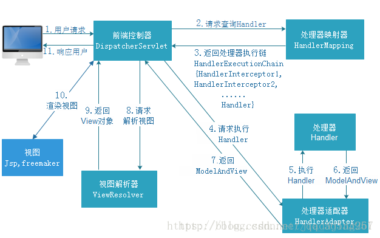

# SpringMVC基础知识
## Springmvc 执行流程是什么?


1. 用户发送请求到前端控制器DispatcherServlet
2. DispatcherServlet收到请求调用处理映射器HandlerMapping
3. 处理映射器根据请求url找到具体的处理器，生成处理器执行链HandlerExecutionChain（包含处理器对象和处理器拦截器）返回给DispatcherServlet
4. DispatcherServlet根据处理器Handler获取对应的适配器
5. HandlerAdapter调用处理器Handler
6. Handler（Controller）执行完成后返回ModelAndView
7. HandlerAdapter返回ModelAndView
8. DispatcherServlet统一将返回的ModelAndView派送到ViewResolve（视图解析器）解析
9. 视图解析器解析之后返回View
10. 对View进行渲染
11. 响应用户

## Springmvc 中如何解决 GET | POST请求中文乱码问题？

### GET请求：
1. js修改
每次发生请求之前对URL进行编码：例如：Location.href="/encodeURI"(“http://localhost/test/s?name=中文&sex=女”);
2. 服务器配置
更简便的方法，在服务器端配置URL编码格式：修改tomcat的配置文件server.xml：
只需增加 URIEncoding=“UTF-8” 这一句，然后重启tomcat即可。
```xml
<ConnectorURIEncoding="UTF-8" 
    port="8080"  maxHttpHeaderSize="8192"  maxThreads="150" 
    minSpareThreads="25"  maxSpareThreads="75"connectionTimeout="20000" 	
    disableUploadTimeout="true" URIEncoding="UTF-8" />
```

### POST请求
可以每次在request解析数据时设置编码格式：request.setCharacterEncoding(“utf-8”);
也可以使用编码过滤器来解决，最常用的方法是使用Spring提供的编码过滤器：
在Web.xml中增加如下配置（要注意的是它的位置一定要是第一个执行的过滤器）：
```xml
<filter>
    <filter-name>charsetFilter</filter-name>
    <filter-class>org.springframework.web.filter.CharacterEncodingFilter</filter-class>
    <init-param>
        <param-name>encoding</param-name>
        <param-value>UTF-8</param-value>
    </init-param>
    <init-param>
        <param-name>forceEncoding</param-name>
        <param-value>true</param-value>
    </init-param>
</filter>
```
## 怎么样设定重定向和转发的？
在返回值前面加"forward:“就可以让结果转发,譬如"forward:user.do?name=method4”

在返回值前面加"redirect:“就可以让返回值重定向,譬如"redirect:http://www.baidu.com”

## 怎么和AJAX相互调用的？
通过Jackson框架就可以把Java里面的对象直接转化成Js可以识别的Json对象。具体步骤如下 ：
加入Jackson.jar
在配置文件中配置json的映射
在接受Ajax方法里面可以直接返回Object,List等,但方法要加上@ResponseBody注解

## Springmvc如何做异常处理？
1. 使用**系统定义好的异常处理器SimpleMappingResolver**，该方式只需要在 SpringMVC 配置文件中注册该异常处理器 Bean 即可。
2. 自定义异常处理器需要**实现 HandlerExceptionResolver 接口**，并且该类需要在 SpringMVC配置文件中进行注册。 
3. **使用异常处理注解**。使用注解@ExceptionHandler 可以将一个方法指定为异常处理方法。该注解只有一个可选属性 value，为一个 Class<?>数组，用于指定该注解的方法所要处理的异常类，即所要匹配的异常。 而被注解的方法，其返回值可以是 ModelAndView、String，或 void，方法名随意，方法参数可以是 Exception 及其子类对象、HttpServletRequest、HttpServletResponse 等。系统会自动为这些方法参数赋值。对于异常处理注解的用法，也可以直接将异常处理方法注解于 Controller 之中。 
   
## 控制器是不是单例模式,如果是,有什么问题,怎么解决？
是单例模式,所以在多线程访问的时候有线程安全问题,不要用同步,会影响性能的解决方案是在控制器里面不能写成员变量。

## 如果拦截get方式提交,怎么配置？
可以在@RequestMapping注解里面加上method=RequestMethod.GET

## 怎么样把ModelMap里面的数据放入Session里面？
可以在类上面加上@SessionAttributes注解,里面包含的字符串就是要放入session里面的key。

## 系统如何分层？
系统分为表现层（UI）：数据的展现，操作页面，请求转发。

业务层（服务层）：封装业务处理逻辑

持久层（数据访问层）：封装数据访问逻辑

各层之间的关系： 表示层通过接口调用业务层，业务层通过接口调用持久层，这样，当下一层发生变化改变，不影响上一层的数据。 MVC是一种表现层的架构

## Springmvc 和struts2的区别有哪些?
springmvc的入口是一个servlet即前端控制器（DispatchServlet），而struts2入口是一个filter过虑器（StrutsPrepareAndExecuteFilter）。
springmvc是基于方法开发(一个url对应一个方法)，请求参数传递到方法的形参，可以设计为单例或多例(建议单例)，struts2是基于类开发，传递参数是通过类的属性，只能设计为多例。
Struts采用值栈存储请求和响应的数据，通过OGNL存取数据，springmvc通过参数解析器是将request请求内容解析，并给方法形参赋值，将数据和视图封装成ModelAndView对象，最后又将ModelAndView中的模型数据通过reques域传输到页面。Jsp视图解析器默认使用jstl。

## Springmvc 用什么对象从后台向前台传递数据？
通过ModelMap对象,可以在这个对象里面用put方法,把对象加到里面,前台就可以通过el表达式拿到。request作用域

## springmvc 中当一个方法向AJAX返回特殊对象,譬如Object,List等,需要做什么处理？
要加上@ResponseBody注解。

## Springmvc 中对于文件的上传有哪些需要注意
在页面form中提交enctype="multipart/form-data"的数据时，需要springmvc对multipart类型的数据进行解析。
在springmvc.xml中配置multipart类型解析器。
方法中使用：MultipartFile attach (单个文件上传) 或者 MultipartFile[] attachs (多个文件上传)

## 拦截器如何使用
定义拦截器：实现HandlerInterceptor接口。接口中提供三个方法。
1. preHandle ：进入 Handler方法之前执行，用于身份认证、身份授权，比如身份认证，如果认证通过表示当前用户没有登陆，需要此方法拦截不再向下执行
2. postHandle：进入Handler方法之后，返回modelAndView之前执行，应用场景从modelAndView出发：将公用的模型数据(比如菜单导航)在这里传到视图，也可以在这里统一指定视图
3. afterCompletion：执行Handler完成执行此方法，应用场景：统一异常处理，统一日志处理

针对HandlerMapping配置(不推荐)：springmvc拦截器针对HandlerMapping进行拦截设置，如果在某个HandlerMapping中配置拦截，经过该 HandlerMapping映射成功的handler最终使用该 拦截器。(一般不推荐使用)
针对全局的拦截器：springmvc配置类似全局的拦截器，springmvc框架将配置的类似全局的拦截器注入到每个HandlerMapping中。

springmvc.xml文件的配置：
```xml
    <!--配置拦截器, 多个拦截器,顺序执行 -->
<mvc:interceptors>
    <mvc:interceptor>
                   <!--  
                       /**的意思是所有文件夹及里面的子文件夹 
                       /*是所有文件夹，不含子文件夹 
                       /是web项目的根目录
                     --> 
       <mvc:mapping path="/**" /> 
            <!-- 需排除拦截的地址 -->  
            <!--  <mvc:exclude-mapping path="/userController/login"/>  -->
        <bean id="comInterceptor" class="org.shop.CommonInterceptor"/>
    </mvc:interceptor> 
          <!-- 当设置多个拦截器时，先按顺序调用preHandle方法，
然后逆序调用每个拦截器的postHandle和afterCompletion方法  -->

      <!--拦截器2-->
    <mvc:interceptor>
        <mvc:mapping path="/hello"/>
        <bean class="com.ma.interceptor.Interceptor2"/>
    </mvc:interceptor>
</mvc:interceptors>
```

## 拦截器Filter和过滤器的区别
1. 拦截器是基于java的反射机制的，而过滤器是基于函数回调。
2. 过滤器是servlet规范规定的，只能用于web程序中，而拦截器是在spring容器中，它不依赖servlet容器。
3. 过滤器可以拦截几乎所有的请求(包含对静态资源的请求)，而拦截器只拦截action请求(不拦截静态资源请求)。
4. 拦截器可以访问action上下文、值栈里的对象，而过滤器不能访问。
5. 在action的生命周期中，拦截器可以多次被调用，而过滤器只能在容器初始化时被调用一次。
6. 拦截器可以获取IOC容器中的各个bean，而过滤器就不行，这点很重要，在拦截器里注入一个service，可以调用业务逻辑。
7. 拦截器是被包裹在过滤器之中。

二者之间的执行顺序:
1. 过滤器是JavaEE标准，采用函数回调的方式进行。是在请求进入容器之后，还未进入Servlet之前进行预处理，并且在请求结束返回给前端这之间进行后期处理。
2. 拦截器是被包裹在过滤器之中的。


## 什么是 SpringMvc？Spring MVC 的优点有哪些？
1. 它是基于组件技术的.全部的应用对象,无论控制器和视图,还是业务对象之类的都是 java 
组件.并且和 Spring 提供的其他基础结构紧密集成. 
2. 不依赖于 Servlet API(目标虽是如此,但是在实现的时候确实是依赖于 Servlet 的) 
3. 可以任意使用各种视图技术,而不仅仅局限于 JSP 
4. 支持各种请求资源的映射策略 
5. 它应是易于扩展的
   
## SpingMvc 中的控制器的注解一般用那个,有没有别的注解可以替代？
一般用@Conntroller 注解,表示是表现层,也可以用@RestController注解代替。

## @RequestMapping 注解用在类上面有什么作用？
是一个用来处理请求地址映射的注解，可用于类或方法上。用于类上，表示类中的所 
有响应请求的方法都是以该地址作为父路径。

## 怎么样把某个请求映射到特定的方法上面？
直接在方法上面加上注解@RequestMapping,并且在这个注解里面写上要拦截的路径

## 如果在拦截请求中,我想拦截 get 方式提交的方法,怎么配置？
可以在@RequestMapping 注解里面加上 method=RequestMethod.GET

## 怎么样在方法里面得到 Request,或者 Session？
直接在方法的形参中声明 request,SpringMVC 就自动把 request 对象传入

## 我想在拦截的方法里面得到从前台传入的参数,怎么得到？
直接在形参里面声明这个参数就可以,但必须名字和传过来的参数一样

## 如果前台有很多个参数传入,并且这些参数都是一个对象的,那么怎么样快速得到这个对象？ 
直接在方法中声明这个对象,SpringMvc 就自动会把属性赋值到这个对象里面。

## SpringMvc 中函数的返回值是什么？
返回值可以有很多类型,有 String, ModelAndView,当一般用 String 比较好。

## SpringMvc 中有个类把视图和数据都合并的一起的,叫什么？
ModelAndView

## 当一个方法向 AJAX 返回特殊对象,譬如 Object,List 等,需要做什么处理？
要加上@ResponseBody 注解